# AntySpend API

NestJS backend for the [AntySpend](https://github.com/technovolution/AntySpend) Android app. Provides JWT auth (Google Sign-In), CRUD for all financial entities, AI expense extraction & leak analysis (OpenRouter), exchange-rate proxy, and offline-first LWW sync.

## Stack

- NestJS 11 + TypeScript
- MongoDB (Mongoose)
- JWT + Google idToken verification
- OpenRouter (server-side only)
- ExchangeRate-API proxy with Mongo cache
- Google Play subscription verification (Personal & Family tiers)
- Swagger UI at `/docs`, OpenAPI JSON at `/docs-json` and `/openapi.json` (when `ENABLE_SWAGGER=true`)

## Prerequisites

- Node.js 20+
- MongoDB 6+ (local or Atlas)
- Google OAuth Web Client ID (same as Android)
- OpenRouter API key (for AI endpoints)
- ExchangeRate-API token (optional; for live FX rates)
- Google Play service account JSON with Play Console API access (for subscription verification)

## Setup

```bash
cd antyspend-api
cp .env.example .env
# Edit .env with your values

npm install
npm run start:dev
```

API runs at `http://localhost:3000`.

Set `ENABLE_SWAGGER=true` in `.env` to expose Swagger (off by default).

| Resource | URL |
|---|---|
| Swagger UI | `http://localhost:3000/docs` (requires `ENABLE_SWAGGER=true`) |
| OpenAPI JSON | `http://localhost:3000/docs-json` or `http://localhost:3000/openapi.json` (requires `ENABLE_SWAGGER=true`) |

Use **Authorize** in Swagger UI with `Bearer <accessToken>` from `POST /auth/google`.

### Export OpenAPI spec

```bash
# With the dev server running and ENABLE_SWAGGER=true:
curl -s http://localhost:3000/openapi.json -o openapi.json

# Or from docs-json:
curl -s http://localhost:3000/docs-json -o openapi.json
```

## Environment variables

| Variable | Required | Description |
|---|---|---|
| `MONGODB_URI` | Yes | MongoDB connection string |
| `JWT_SECRET` | Yes | Secret for signing JWT (min 16 chars) |
| `JWT_ACCESS_EXPIRES` | No | Access token TTL (default `15m`) |
| `JWT_REFRESH_EXPIRES` | No | Refresh token TTL (default `7d`) |
| `GOOGLE_CLIENT_ID` | Yes | Google OAuth Web Client ID |
| `OPENROUTER_API_KEY` | For AI | OpenRouter API key |
| `OPENROUTER_MODEL` | No | Model id (default `google/gemini-2.5-flash-lite`) |
| `OPENROUTER_VISION_MODEL` | No | Vision model for receipt extraction (default `google/gemini-2.5-flash`) |
| `EXCHANGE_RATE_API_TOKEN` | For FX | ExchangeRate-API v6 token |
| `RATE_LIMIT_MAX` | No | Max requests per client per window (default `50`) |
| `RATE_LIMIT_TTL_MS` | No | Rate limit window in ms (default `60000`) |
| `ENABLE_SWAGGER` | No | Expose `/docs` and OpenAPI JSON (default `false`) |
| `GOOGLE_PLAY_PACKAGE_NAME` | For billing | Android app id (default `com.technovolution.antyspend`) |
| `GOOGLE_PLAY_SERVICE_ACCOUNT_JSON_BASE64` | For billing (prod) | Base64-encoded Play service account JSON (Azure App Settings) |
| `GOOGLE_PLAY_SERVICE_ACCOUNT_JSON` | For billing (local) | Filesystem path or inline JSON; leave empty in prod when using Base64 |
| `RTDN_ENABLED` | For RTDN | Enable Pub/Sub push webhook processing (default `false`) |
| `GOOGLE_PUBSUB_PUSH_AUDIENCE` | For RTDN | OIDC audience for push auth (webhook URL) |
| `GOOGLE_PUBSUB_PUSH_SERVICE_ACCOUNT_EMAIL` | For RTDN | Expected service account email on push JWT |
| `RTDN_SKIP_AUTH` | For RTDN | Skip Pub/Sub OIDC auth (local dev only; default `false`) |
| `PORT` | No | HTTP port (default `3000`) |

## Security

### Rate limiting

- **50 requests per minute** per client (configurable via `RATE_LIMIT_MAX` / `RATE_LIMIT_TTL_MS`).
- Client identity: **`userId` from a valid JWT access token**, otherwise **client IP** (respects `trust proxy` for one hop behind a reverse proxy).
- Returns **429 Too Many Requests** when exceeded.
- Swagger/OpenAPI routes (`/docs`, `/docs-json`, `/openapi.json`) are excluded when enabled via `ENABLE_SWAGGER=true`.
- Leave **`ENABLE_SWAGGER=false`** in production unless you explicitly need public API docs.
- Storage is **in-memory** (single instance). Use Redis-backed throttling for multi-replica deployments.

### NoSQL injection protection

Defense in depth for MongoDB writes and queries:

1. **HTTP middleware** — strips `$` operator keys and dotted keys from JSON **request bodies** before validation (Express 5 `req.query` is read-only; query/route params use DTOs and `ParseEntityIdPipe`).
2. **Validation** — `ValidationPipe` whitelists DTO fields; sync payloads reject nested Mongo operators via `@RejectMongoOperators()`.
3. **Service layer** — `sanitizeDocumentForStorage()` deep-strips dangerous keys before any `$set` in sync, CRUD, and settings updates.
4. **Mongoose** — `strictQuery` and `strict: true` schemas at connection and schema level.
5. **Route params** — CRUD `:id` params must match 32-char hex (`ParseEntityIdPipe`).

### MongoDB Atlas recommendations

- Use a **least-privilege** database user (read/write on the app database only).
- Enable **IP allowlist** (or VPC peering) for production.
- Store `MONGODB_URI` only in environment secrets; rotate credentials periodically.
- Never log connection strings in production.


Vertical slices per domain module:

```
src/modules/<slice>/
  presentation/   # Controllers
  application/    # Use cases / services
  infrastructure/ # Mongo schemas (shared in entity.schemas.ts)
  dto/            # Request/response DTOs
```

Shared cross-cutting code lives in `src/shared/` (config, auth, sync LWW, OpenRouter client, prompts).

## Key endpoints

### Auth
- `POST /auth/google` — exchange Google idToken for JWT pair
- `POST /auth/refresh` — refresh access token
- `POST /auth/logout` — revoke refresh token
- `DELETE /auth/account` — permanently delete authenticated user and all cloud data (Bearer JWT)
- `GET /auth/me` — authenticated profile

### AI (Bearer JWT)
- `POST /ai/expense-extraction` — `{ text, defaultCurrencyCode?, userLanguage? }`
- `POST /ai/receipt-extraction` — `{ imageBase64, mimeType, defaultCurrencyCode?, userLanguage?, ocrText? }`
- `POST /ai/leak-analysis` — `{ month?, userLanguage? }` (loads transactions from Mongo)

### Exchange rates
- `GET /exchange-rates/latest` — USD-based rates (Mongo cache, 1 snapshot/día UTC)

### CRUD (Bearer JWT, scoped by userId)
- `GET|POST|PATCH|DELETE /wallets`
- `GET|POST|PATCH|DELETE /categories`
- `GET|POST|PATCH|DELETE /merchants`
- `GET|POST|PATCH|DELETE /transactions`
- `GET|POST|PATCH|DELETE /budgets`
- `GET|POST|PATCH|DELETE /recurring-expenses`
- `POST /recurring-expenses/:id/mark-paid`
- `GET|POST|PATCH|DELETE /savings-plans`
- `GET|POST|PATCH|DELETE /savings-movements`
- `GET|POST|PATCH|DELETE /investments`
- `GET|POST|PATCH|DELETE /investment-movements`
- `GET|PATCH /settings`
- `GET /currencies` — global catalog (seeded on startup)
- `POST /currencies/seed` — re-run seed

### Entitlements (Bearer JWT)
- `GET /entitlements/me` — current subscription: `planType`, `status`, `expiresAtMillis`, `productId`, `source`, `active`
- `POST /entitlements/verify-purchase` — `{ productId, purchaseToken, packageName? }` verifies with Google Play and upserts entitlement

### Webhooks (Pub/Sub push, no user JWT)
- `POST /webhooks/google-play/rtdn` — Google Play Real-time Developer Notifications via Cloud Pub/Sub push

Product IDs (configure matching subscriptions in Play Console):
- `antyspend_personal_monthly` — Personal tier (cloud sync)
- `antyspend_family_monthly` — Family tier (Personal + household features)

### Sync (Bearer JWT)
- `POST /sync/push` — bulk LWW push `{ changes[], lastKnownServerVersion?, deviceId? }`
- `GET /sync/pull?since=<serverVersion>` — pull all user entities

All syncable entities include: `id`, `userId`, `createdAtMillis`, `updatedAtMillis`, optional `deletedAtMillis`, `clientUpdatedAtMillis`, `deviceId`.

**LWW rule:** client wins if `updatedAtMillis` is newer; on tie, lexicographically greater `deviceId` wins, else server wins.

## Scripts

```bash
npm run start:dev    # watch mode
npm run build        # compile
npm run start:prod   # run compiled
npm test             # unit tests
npm run test:e2e     # e2e tests
npm run billing:encode-sa -- /path/to/play-service-account.json  # Base64 for Azure
```

## Azure App Service deploy

See **[docs/DEPLOY.md](docs/DEPLOY.md)** for startup command, required Application settings, log stream, and troubleshooting.

Zip deploy pre-builds `dist/` locally or in CI, then Oryx runs **`npm ci --omit=dev` only** on the server (see `.deployment`: `CUSTOM_BUILD_COMMAND`). Remote `nest build` is avoided to prevent heap OOM on Basic tier.

**Minimum App Settings to boot:** `MONGODB_URI`, `JWT_SECRET` (≥16 chars), `GOOGLE_CLIENT_ID`, plus `NODE_ENV=production`. Azure injects `PORT=8080` automatically.

**Startup:** default `npm start` runs `node dist/src/main` (compiled output). Do not use `nest start` on the server.

- **VS Code:** copy [`.vscode/settings.json.example`](.vscode/settings.json.example) → `.vscode/settings.json` so deploy runs `npm run build` first and uploads `dist/`.
- **GitHub Actions:** workflow builds on the runner, then deploys the artifact (no remote rebuild).
- **Logs:** Azure Portal → App Service → **Log stream**; look for `AntySpend API listening on port 8080` or `AntySpend API failed to start:` on env errors.

## Google Play Console setup

1. Create app `com.technovolution.antyspend` in [Google Play Console](https://play.google.com/console).
2. Create two monthly base-plan subscriptions:
   - `antyspend_personal_monthly`
   - `antyspend_family_monthly`
3. In **Setup → API access**, link a Google Cloud project and create a service account with **View financial data** (or equivalent Play billing read access).
4. Download the service account JSON.
   - **Local dev:** set `GOOGLE_PLAY_SERVICE_ACCOUNT_JSON` in `.env` to the file path.
   - **Azure (production):** run `npm run billing:encode-sa -- /path/to/play-sa.json`, copy the Base64 output, and set `GOOGLE_PLAY_SERVICE_ACCOUNT_JSON_BASE64` in App Service **Environment variables**. Application settings persist across VS Code zip deploys — configure once, then deploy code as usual.
5. Add license testers under **Setup → License testing** for sandbox purchases.
6. Publish the app to an **Internal testing** track to exercise real billing flows before production.

The Android client calls `POST /entitlements/verify-purchase` after each purchase (and on restore) with the Play `purchaseToken`. The API calls `androidpublisher.purchases.subscriptionsv2.get` (with v1 fallback) to confirm expiry and upserts `user_entitlements`.

## Real-time Developer Notifications (RTDN)

Google Play sends subscription lifecycle events (renewal, cancellation, expiration, grace period, etc.) to a Cloud Pub/Sub topic. A push subscription forwards them to the API webhook, which re-verifies the purchase with the Play Developer API and updates `user_entitlements` by `googlePlayPurchaseToken`.

RTDN **does not replace** the client `POST /entitlements/verify-purchase` on first purchase; it keeps entitlements in sync afterward.

### Flow

```mermaid
flowchart TB
    subgraph purchase [First purchase - synchronous]
        A1[App Play Store] --> A2[acknowledgePurchase]
        A2 --> A3["POST /entitlements/verify-purchase"]
        A3 --> A4[Play subscriptionsv2.get]
        A4 --> A5[user_entitlements upsert by userId]
    end

    subgraph rtdn [Lifecycle - asynchronous]
        R1[Google Play RTDN] --> R2[Pub/Sub topic play-billing-rtdn]
        R2 --> R3["POST /webhooks/google-play/rtdn"]
        R3 --> R4[Dedup by messageId]
        R4 --> R5[Decode DeveloperNotification]
        R5 --> R6[Play API re-verify]
        R6 --> R7[Update by purchaseToken]
    end
```



### GCP Pub/Sub setup

1. Create topic `play-billing-rtdn` in your linked GCP project.
2. Grant **Pub/Sub Publisher** on the topic to `google-play-developer-notifications@system.gserviceaccount.com`.
3. Create push subscription `play-billing-rtdn-push`:
   - **Push endpoint:** `https://api.antyspend.com/webhooks/google-play/rtdn`
   - **Authentication:** OIDC token with your API service account as invoker
   - **Audience:** same as `GOOGLE_PUBSUB_PUSH_AUDIENCE` (the webhook URL)

### Play Console setup

1. **Monetize → Monetization setup → Real-time developer notifications**
2. Set topic: `projects/{GCP_PROJECT_ID}/topics/play-billing-rtdn`
3. Click **Send test notification** — the API should return `200` with `{ "ok": true }`
4. Save

### RTDN environment variables

| Variable | Description |
|---|---|
| `RTDN_ENABLED` | `true` to enforce Pub/Sub OIDC auth in production |
| `GOOGLE_PUBSUB_PUSH_AUDIENCE` | Webhook URL used as JWT audience |
| `GOOGLE_PUBSUB_PUSH_SERVICE_ACCOUNT_EMAIL` | Expected `email` claim on push JWT |
| `RTDN_SKIP_AUTH` | `true` for local testing without OIDC (never in production) |

When `RTDN_ENABLED=false`, audience is unset in development, or `RTDN_SKIP_AUTH=true`, the webhook skips OIDC verification (with a warning log).

See [docs/DEPLOY-BILLING.md](docs/DEPLOY-BILLING.md) for production deployment checklist and curl verification commands.

## Android integration

1. After Google Sign-In, POST idToken to `/auth/google`; store `accessToken` + `refreshToken`.
2. Send `Authorization: Bearer <accessToken>` on all protected routes.
3. On 401, refresh via `/auth/refresh`.
4. Replace direct OpenRouter / ExchangeRate calls with `/ai/*` and `/exchange-rates/latest`.
5. Use `/sync/push` and `/sync/pull` for offline-first Room sync.
6. After a Play subscription purchase, call `POST /entitlements/verify-purchase`; poll `GET /entitlements/me` for UI state.

## License

Private — AntySpend project.
